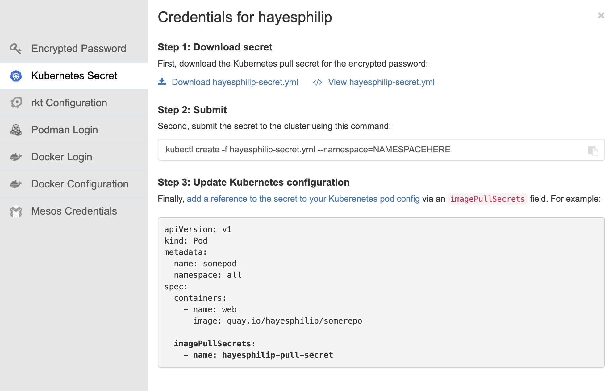

# ModelCar Pipeline

A Tekton pipeline for downloading models from Hugging Face, compressing them, packaging them into ModelCar images, and deploying them using RHAIIS in OpenShift.


## Prerequisites

- OpenShift AI cluster with GPU-enabled node (e.g., AWS EC2 g6.12xlarge instance providing 4 x NVIDIA L4 Tensor Core GPUs)
- Access to Quay.io (for pushing images)
- Access to Hugging Face (for downloading models)
- OpenShift model registry service
- Service account with appropriate permissions
- Quay.io authentication secret

## Features

- Downloads models from Hugging Face with customizable file patterns
- Optional model compression using RHAIIS LLM Compressor
- Packages models into OCI images using OLOT
- Pushes images to Quay.io
- Registers models in the OpenShift model registry
- Optional deployment as InferenceService with GPU support
- Waits until the model is deployed to complete pipeline
- Supports skipping specific tasks

## Prerequisites

- OpenShift AI cluster with GPU-enabled nodes
- Access to Quay.io (for pushing images)
- Access to Hugging Face (for downloading models)
- OpenShift model registry service
- Service account with appropriate permissions
- Quay.io authentication secret

## Deployment Steps

### 1. Create Required Namespace

```bash
# Create a new namespace for the pipeline
oc new-project modelcar-pipeline
```

### 2. Create Required Secrets

From the quay.io page, go to account settings, and then click on "Generate Encrypted Password", authenticate and then go to the "Kubernetes Secret" tab.



Change the name of the downloaded file to to quay-auth.yaml. Edit the file and change the metadata.name field to "quay-auth"

It should look like this:

```yaml
apiVersion: v1
kind: Secret
metadata:
  name: quay-auth
data:
  .dockerconfigjson: xxxxxxxxxxx
type: kubernetes.io/dockerconfigjson
```

Create the secret:

```bash
oc apply -f quay-auth.yaml
```

Login to Huggingface https://huggingface.co/settings/tokens and copy your access_token

Set this as an environment variable with 

```bash
export HF_TOKEN=xxx
```

# Create Hugging Face token secret by running:

```bash
cat <<EOF | oc create -f -
apiVersion: v1
kind: Secret
metadata:
  name: huggingface-secret
type: Opaque
data:
  HUGGINGFACE_TOKEN: $(echo $HF_TOKEN | base64)
EOF
```

### 3. Create Service Account and Permissions

```bash
# Create service account
oc create serviceaccount modelcar-pipeline

# Create role for model registry access
cat <<EOF | oc create -f -
apiVersion: rbac.authorization.k8s.io/v1
kind: Role
metadata:
  name: model-registry-access
rules:
- apiGroups: ["serving.kserve.io"]
  resources: ["inferenceservices", "servingruntimes"]
  verbs: ["get", "list", "watch", "create", "update", "patch", "delete"]
- apiGroups: [""]
  resources: ["secrets"]
  verbs: ["get", "list"]
EOF

# Bind role to service account
cat <<EOF | oc create -f -
apiVersion: rbac.authorization.k8s.io/v1
kind: RoleBinding
metadata:
  name: model-registry-access
subjects:
- kind: ServiceAccount
  name: modelcar-pipeline
roleRef:
  kind: Role
  name: model-registry-access
  apiGroup: rbac.authorization.k8s.io
EOF
```

### 4. Update Resource Quota to ensure 4 gpus are allowed

```bash
# Create or update resource quota for GPU resources
cat <<EOF | oc apply -f -
apiVersion: v1
kind: ResourceQuota
metadata:
  name: modelcar-pipeline-core-resource-limits
spec:
  hard:
    requests.nvidia.com/gpu: "4"
    limits.nvidia.com/gpu: "4"
EOF
```

### 5. Create Storage

```bash
# Create storage class for pipeline workspace
oc create -f modelcar-storage.yaml
```

### 6. Deploy Pipeline

```bash
# Create the pipeline
oc create -f modelcar-pipeline.yaml

# Create the compress-task
oc create -f modelcar-compress-task.yaml

# Create the compress-task
oc create -f compress-script-configmap.yaml

# Create the pipeline run
cat <<EOF | oc create -f -
apiVersion: tekton.dev/v1beta1
kind: PipelineRun
metadata:
  name: modelcar-pipelinerun
spec:
  pipelineRef:
    name: modelcar-pipeline
  serviceAccountName: modelcar-pipeline
  params:
    - name: HUGGINGFACE_MODEL
      value: "ibm-granite/granite-3.2-2b-instruct"
    - name: OCI_IMAGE
      value: "quay.io/my-user/my-modelcar"
    - name: HUGGINGFACE_ALLOW_PATTERNS
      value: "*.safetensors *.json *.txt"
    - name: COMPRESS_MODEL
      value: "true"
    - name: MODEL_NAME
      value: "granite-3.2-2b-instruct"
    - name: MODEL_VERSION
      value: "1.0.0"
    - name: MODEL_REGISTRY_URL
      value: "https://registry-rest.apps.dev.xxx.com"
    - name: DEPLOY_MODEL
      value: "true"
  workspaces:
    - name: shared-workspace
      volumeClaimTemplate:
        spec:
          accessModes:
            - ReadWriteOnce
          resources:
            requests:
              storage: 10Gi
    - name: quay-auth-workspace
      secret:
        secretName: quay-auth
EOF
```

### 7. Verify Deployment

```bash
# Check pipeline status
oc get pipelinerun

```

## Pipeline Parameters

| Parameter | Description | Default |
|-----------|-------------|---------|
| `HUGGINGFACE_MODEL` | Hugging Face model repository (e.g., "ibm-granite/granite-3.2-2b-instruct") | - |
| `OCI_IMAGE` | OCI image destination (e.g., "quay.io/my-user/my-modelcar") | - |
| `HUGGINGFACE_ALLOW_PATTERNS` | Space-separated list of file patterns to allow (e.g., "*.safetensors *.json *.txt") | "" |
| `COMPRESS_MODEL` | Whether to compress the model using GPTQ (true/false) | "false" |
| `MODEL_NAME` | Name of the model to register in the model registry | - |
| `MODEL_VERSION` | Version of the model to register | "1.0.0" |
| `SKIP_TASKS` | Comma-separated list of tasks to skip | "" |
| `MODEL_REGISTRY_URL` | URL of the model registry service | - |
| `DEPLOY_MODEL` | Whether to deploy the model as an InferenceService (true/false) | "false" |

### Skipping Tasks

The pipeline supports skipping specific tasks using the `SKIP_TASKS` parameter. This is useful for example if you want to deploy a model without redoing the entire pipeline. For example, to skip all tasks up to the deploy stage:

```bash
SKIP_TASKS="cleanup-workspace,pull-model-from-huggingface,compress-model,build-and-push-modelcar,register-with-registry"
```

## Model Deployment

When `DEPLOY_MODEL` is set to "true", the pipeline will:
1. Create a ServingRuntime with GPU support
2. Deploy an InferenceService using the model
3. Wait for the service to be ready
4. Save the service URL to the workspace

The deployment includes:
- GPU resource allocation
- Memory and CPU limits
- Automatic scaling configuration
- Service URL detection
- Health monitoring

### Resource Requirements

The default deployment configuration includes:
- 1 NVIDIA GPU
- 2 CPU cores
- 8GB memory
- 4GB memory requests

These can be adjusted in the pipeline configuration if needed.

## Example Configuration

```yaml
apiVersion: tekton.dev/v1beta1
kind: PipelineRun
metadata:
  name: modelcar-pipelinerun
spec:
  pipelineRef:
    name: modelcar-pipeline
  params:
    - name: HUGGINGFACE_MODEL
      value: "ibm-granite/granite-3.2-2b-instruct"
    - name: OCI_IMAGE
      value: "quay.io/my-user/my-modelcar"
    - name: HUGGINGFACE_ALLOW_PATTERNS
      value: "*.safetensors *.json *.txt"
    - name: COMPRESS_MODEL
      value: "true"
    - name: MODEL_NAME
      value: "granite-3.2-2b-instruct"
    - name: MODEL_VERSION
      value: "1.0.0"
    - name: MODEL_REGISTRY_URL
      value: "https://registry-rest.apps.dev.xxx.com"
    - name: DEPLOY_MODEL
      value: "true"
  workspaces:
    - name: shared-workspace
      volumeClaimTemplate:
        spec:
          accessModes:
            - ReadWriteOnce
          resources:
            requests:
              storage: 10Gi
    - name: quay-auth-workspace
      secret:
        secretName: quay-auth
```

## Monitoring

To monitor the pipeline execution:

```bash
# Check pipeline status
oc get pipelinerun modelcar-pipelinerun

# View pipeline logs
oc logs -f pipelinerun/modelcar-pipelinerun

# Check model registry
oc get registeredmodel
oc get modelversion

# Check InferenceService status (if deployed)
oc get inferenceservice
oc get ksvc
```

## Notes

- The pipeline uses Red Hat UBI (Universal Base Image) for all tasks
- Model compression is optional and can be skipped
- The pipeline supports skipping specific tasks using the `SKIP_TASKS` parameter
- Model deployment requires GPU-enabled nodes in the cluster
- The service URL is saved to the workspace for future reference