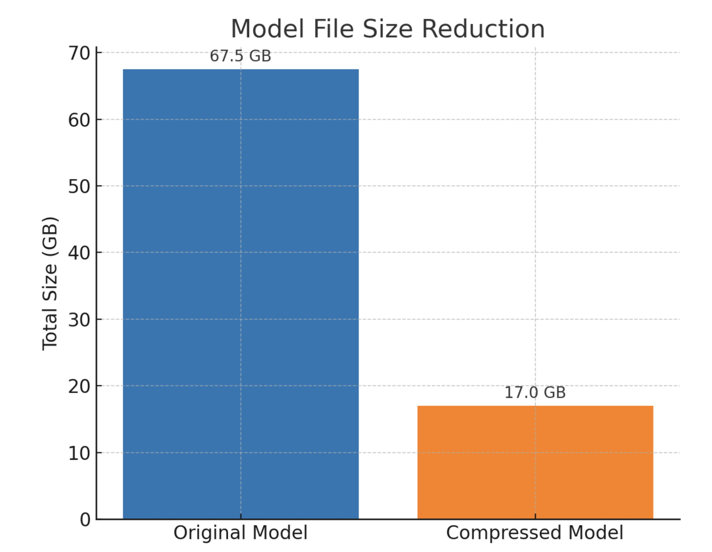
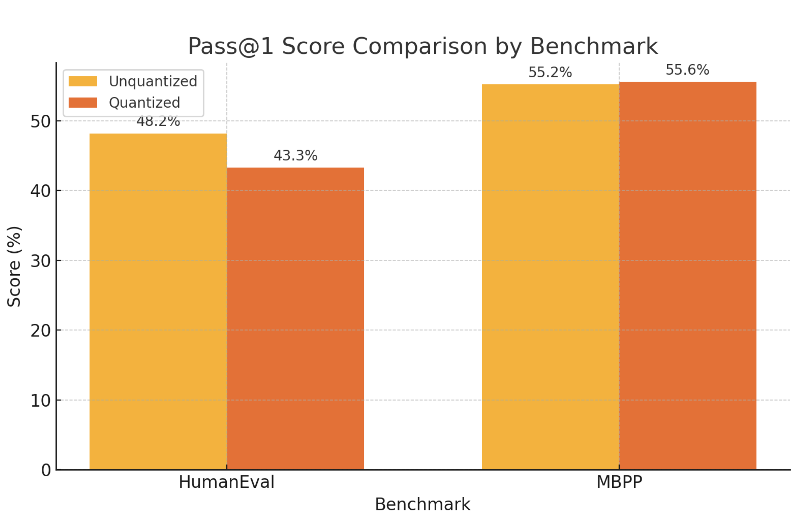
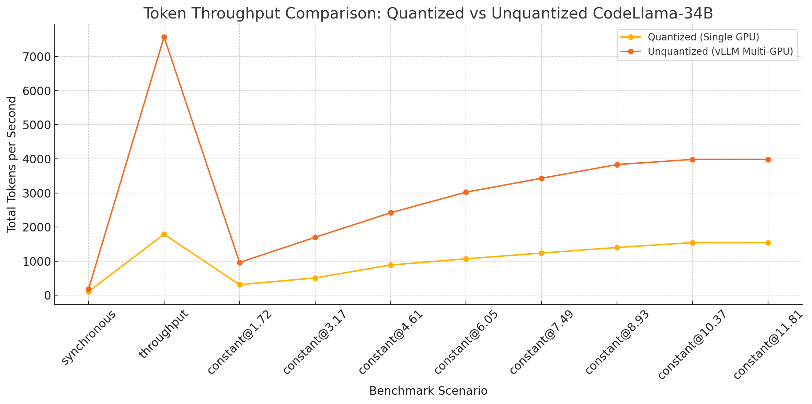
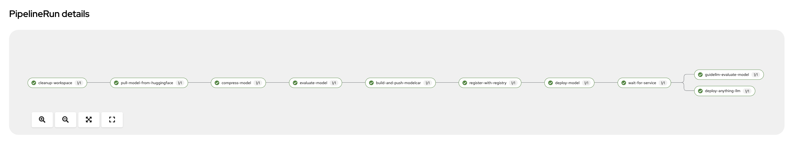

# ModelCar Pipeline

A Tekton pipeline for downloading models from Hugging Face, compressing the model weights, running evaluation benchmarks, packaging them into ModelCar images, and deploying them on OpenShift AI, and then running performance benchmarks using [GuideLLM](https://github.com/neuralmagic/guidellm).


We tested this pipeline with the `codellama/CodeLlama-34b-Python-hf` model, which is an example of a reasonably large model (34 billion parameters) which performs coding tasks well, but requires multiple GPUs to run (e.g. 4 X NVIDIA L40s).

By running this model through the LLM Compressor, reducing the weights from FP16 precision, to 4 bit precision, this model can be deployed on a single NVIDIA L40.

# Results overview

## Model weight file size
The first thing we can look at is the reduction in model weight file size, as you can see from the chart below, the total file size of the model weights reduced from 67.5 Gb to 17Gb, a significant reduction.



## Benchmarks

The next thing we can look at are the benchmark results.  Quantization maintains comparable performance with the unquantized model across the coding focussed benchmarks humaneval and mbpp.



## Throughput

Even though the quantized model is running on 1 GPU (25% of the hardware used by the unquantized model), the model achieves 25–39% of the unquantized throughput.



## Features

- Downloads models from Hugging Face with customizable file patterns
- Optional model compression using RHAIIS LLM Compressor
- Performs evaluation against deployed model using lm-evaluation-harness
- Packages models into OCI images using [OLOT](https://github.com/containers/olot)
- Pushes images to Quay.io
- Registers models in the OpenShift model registry
- Deployment as InferenceService with GPU support
- Waits until the model is deployed to complete pipeline
- Performance benchmarking using containerized GuideLLM
- Deploys AnythingLLM UI configured to use the deployed model
- Supports skipping specific tasks



## Prerequisites

- OpenShift AI cluster with GPU-enabled node (e.g., AWS EC2 g6e.12xlarge instance providing 4 x NVIDIA L40 Tensor Core GPUs)
- Access to Quay.io (for pushing images)
- Access to Hugging Face (for downloading models)
- OpenShift model registry service
- OpenShift CLI (oc)

## Environment Variables

Create a `.env` file in the root directory with the following variables:

```bash
# Quay.io credentials
QUAY_USERNAME="ROBOT_USERNAME"
QUAY_PASSWORD="ROBOT_PASSWORD"
QUAY_REPOSITORY="quay.io/your-org/your-repo"

# Hugging Face token
HUGGINGFACE_MODEL="codellama/CodeLlama-34b-Python-hf"
HF_TOKEN="your_huggingface_token"

# Model Registry
MODEL_REGISTRY_URL="https://model-registry.apps.yourcluster.com"

# Model details
MODEL_NAME="CodeLlama-34b-Python-hf"
MODEL_VERSION="1.0.0"
```

You can get your Hugging Face token from [Hugging Face Settings](https://huggingface.co/settings/tokens).

### Creating a Quay.io Robot Account

To create a robot account in Quay.io:

1. Log in to [Quay.io](https://quay.io)
2. Navigate to your organization or user account
3. Click on "Robot Accounts" in the left sidebar menu
4. Click "Create Robot Account" button
5. Enter a name for the robot account (e.g. `modelcar-pipeline`)
6. Click "Create Robot Account"
7. On the next screen, click "Edit Repository Permissions"
8. Search for and select your target repository
9. Set permissions to "Write" access
10. Click "Update Permission"
11. Save the robot account credentials:
    - Username will be in format: `your-org+robot-name`
    - Password will be shown only once - copy it immediately
12. Use these credentials in your `.env` file:
    ```bash
    QUAY_USERNAME="your-org+robot-name"
    QUAY_PASSWORD="robot-account-password" 
    ```

Note: Make sure to save the password when it's displayed as it cannot be retrieved later. 

Before running any commands, source the environment variables:

```bash
# Source the environment variables
source .env

# Verify the variables are set
echo "Using Quay repository: $QUAY_REPOSITORY"
echo "Using model: $MODEL_NAME"
```

## Deployment Steps

### 1. Create Required Namespace

```bash
# Create a new namespace for the pipeline
oc new-project modelcar-pipeline
```

### 2. Create Required Secrets

#### Create the Quay.io Secret

Create a Kubernetes secret with the robot account credentials:

```bash
# Create the secret using the robot account credentials
cat <<EOF | oc create -f -
apiVersion: v1
kind: Secret
metadata:
  name: quay-auth
type: kubernetes.io/dockerconfigjson
data:
  .dockerconfigjson: $(echo -n '{"auths":{"quay.io":{"auth":"'$(echo -n "${QUAY_USERNAME}:${QUAY_PASSWORD}" | base64)'"}}}' | base64)
EOF
```

#### Create Hugging Face Token Secret

Create Hugging Face token secret by running:

```bash
cat <<EOF | oc create -f -
apiVersion: v1
kind: Secret
metadata:
  name: huggingface-secret
type: Opaque
data:
  HUGGINGFACE_TOKEN: $(echo $HF_TOKEN | base64)
EOF
```

### 3. Create Service Account and Permissions

```bash
# Create service account
oc create serviceaccount modelcar-pipeline
```

### 4. Check resource quotas

First, check for existing resource quotas that may prevent running containers with large memory requirements:

```bash
# Check for existing resource quotas in the namespace
oc get resourcequota

# If quotas exist, review their limits
oc describe resourcequota
```

If existing quotas have insufficient limits for large language models (which require significant memory and GPU resources), you have several options:

1. **Contact your cluster administrator** to increase the quota limits or remove restrictive quotas
2. **Delete existing restrictive quotas** if you have sufficient permissions:
   ```bash
   # Delete a specific resource quota
   oc delete resourcequota <quota-name>
   ```
3. **Update LimitRange** to allow higher memory limits:
   ```bash
   # Check for existing LimitRange
   oc get limitrange
   
   # Edit the LimitRange to increase memory limits
   oc edit limitrange <limitrange-name>
   
   # Update the max memory limits for Container and Pod types:
   # spec:
   #   limits:
   #   - max:
   #       memory: 128Gi  # Increase this value as needed
   #     type: Container
   #   - max:
   #       memory: 128Gi  # Increase this value as needed
   #     type: Pod
   ```
4. **Skip the compression step** if memory limits are too restrictive:
   ```bash
   # Set COMPRESS_MODEL to false and add compress-model to SKIP_TASKS
   COMPRESS_MODEL="false"
   SKIP_TASKS="compress-model"
   ```

**Common error**: If you see errors like `maximum memory usage per Container is 24Gi, but limit is 128Gi`, this indicates your namespace has restrictive resource quotas or LimitRange that prevent the pipeline from running memory-intensive tasks like model compression.

You may need to get your cluster administrator to update the container and pod memory limits to 128Gi.

Then, create a dynamic resource quota file based on the current project name:

```bash
# Get the current project name
export PROJECT_NAME=$(oc project -q)
```

```bash
# Create the resource quota file
cat <<EOF > openshift/resource-quota.yaml
apiVersion: v1
kind: ResourceQuota
metadata:
  name: ${PROJECT_NAME}-core-resource-limits
spec:
  hard:
    requests.cpu: "8"
    requests.memory: 64Gi
    limits.cpu: "16"
    limits.memory: 128Gi
    requests.nvidia.com/gpu: "4"
    limits.nvidia.com/gpu: "4"
EOF
```

### 5. Create OpenShift objects

# Create all OpenShift objects

```bash
oc apply -f openshift/
```

### 6. Create ConfigMaps

Create the compress-script configmap from the Python file which contains the python code to run the LLM Compression.

The `tasks/compress/compress-code.py` script:
- Uses the LLM Compressor library to compress the model using GPTQ quantization
- Configures compression parameters like bits (4-bit quantization) and group size
- Handles multi-GPU compression for faster processing
- Saves the compressed model in the same format as the original
- Includes progress tracking and error handling


Create the registration script ConfigMap:

```bash
# Create the ConfigMap from the Python script
oc create configmap register-script --from-file=tasks/register-with-registry/register.py
```


### 7. Running the pipeline

#### Code tasks models

```bash
oc create configmap compress-script --from-file=compress.py=tasks/compress/compress-code.py
```

Create the PipelineRun using environment variables:

```bash
cat <<EOF | oc create -f -
apiVersion: tekton.dev/v1beta1
kind: PipelineRun
metadata:
  name: modelcar-pipelinerun3
spec:
  pipelineRef:
    name: modelcar-pipeline
  timeout: 6h  # 6-hour timeout
  serviceAccountName: modelcar-pipeline
  params:
    - name: HUGGINGFACE_MODEL
      value: "${HUGGINGFACE_MODEL}"
    - name: OCI_IMAGE
      value: "${QUAY_REPOSITORY}"
    - name: HUGGINGFACE_ALLOW_PATTERNS
      value: "*.safetensors *.json *.txt *.md *.model"
    - name: COMPRESS_MODEL
      value: "true"
    - name: MODEL_NAME
      value: "${MODEL_NAME}"
    - name: MODEL_VERSION
      value: "${MODEL_VERSION}"
    - name: MODEL_REGISTRY_URL
      value: "${MODEL_REGISTRY_URL}"
    - name: DEPLOY_MODEL
      value: "true"
    - name: EVALUATE_MODEL
      value: "true"
    - name: GUIDELLM_EVALUATE_MODEL
      value: "true"
    - name: MAX_MODEL_LEN
	    value: 16000
  workspaces:
    - name: shared-workspace
      persistentVolumeClaim:
        claimName: modelcar-storage
    - name: quay-auth-workspace
      secret:
        secretName: quay-auth
  podTemplate:
    securityContext:
      runAsUser: 1001
      fsGroup: 1001
    tolerations:
      - key: "nvidia.com/gpu"
        operator: "Exists"
        effect: "NoSchedule"
    nodeSelector:
      nvidia.com/gpu.present: "true"
EOF
```
#### General knowledge models

```bash
oc create configmap compress-script --from-file=compress.py=tasks/compress/compress.py
```

Create the PipelineRun using environment variables:

```bash
cat <<EOF | oc create -f -
apiVersion: tekton.dev/v1beta1
kind: PipelineRun
metadata:
  name: modelcar-pipelinerun
spec:
  pipelineRef:
    name: modelcar-pipeline
  timeout: 6h  # 6-hour timeout
  serviceAccountName: modelcar-pipeline
  params:
    - name: HUGGINGFACE_MODEL
      value: "${HUGGINGFACE_MODEL}"
    - name: OCI_IMAGE
      value: "${QUAY_REPOSITORY}"
    - name: HUGGINGFACE_ALLOW_PATTERNS
      value: "*.safetensors *.json *.txt *.md *.model"
    - name: COMPRESS_MODEL
      value: "true"
    - name: MODEL_NAME
      value: "${MODEL_NAME}"
    - name: MODEL_VERSION
      value: "${MODEL_VERSION}"
    - name: MODEL_REGISTRY_URL
      value: "${MODEL_REGISTRY_URL}"
    - name: DEPLOY_MODEL
      value: "true"
    - name: EVALUATE_MODEL
      value: "true"
    - name: GUIDELLM_EVALUATE_MODEL
      value: "true"
    - name: MAX_MODEL_LEN
      value: 8000
    - name: TASKS
      value: "arc_easy,arc_challenge,hellaswag,winogrande"
    # - name: SKIP_TASKS
    #   value: "cleanup-workspace,pull-model-from-huggingface"
  workspaces:
    - name: shared-workspace
      persistentVolumeClaim:
        claimName: modelcar-storage
    - name: quay-auth-workspace
      secret:
        secretName: quay-auth
  podTemplate:
    securityContext:
      runAsUser: 1001
      fsGroup: 1001
    tolerations:
      - key: "nvidia.com/gpu"
        operator: "Exists"
        effect: "NoSchedule"
    nodeSelector:
      nvidia.com/gpu.present: "true"
EOF
```

#### No compression

Create the PipelineRun using environment variables:

```bash
cat <<EOF | oc create -f -
apiVersion: tekton.dev/v1beta1
kind: PipelineRun
metadata:
  name: modelcar-pipelinerun
spec:
  pipelineRef:
    name: modelcar-pipeline
  timeout: 6h  # 6-hour timeout
  serviceAccountName: modelcar-pipeline
  params:
    - name: HUGGINGFACE_MODEL
      value: "${HUGGINGFACE_MODEL}"
    - name: OCI_IMAGE
      value: "${QUAY_REPOSITORY}"
    - name: HUGGINGFACE_ALLOW_PATTERNS
      value: "*.safetensors *.json *.txt *.md *.model"
    - name: COMPRESS_MODEL
      value: "false"
    - name: MODEL_NAME
      value: "${MODEL_NAME}"
    - name: MODEL_VERSION
      value: "${MODEL_VERSION}"
    - name: MODEL_REGISTRY_URL
      value: "${MODEL_REGISTRY_URL}"
    - name: DEPLOY_MODEL
      value: "true"
    - name: EVALUATE_MODEL
      value: "false"
    - name: GUIDELLM_EVALUATE_MODEL
      value: "false"
    - name: MAX_MODEL_LEN
      value: 8000
    - name: TASKS
      value: "arc_easy,arc_challenge,hellaswag,winogrande"
    # - name: SKIP_TASKS
    #   value: "cleanup-workspace,pull-model-from-huggingface"
  workspaces:
    - name: shared-workspace
      persistentVolumeClaim:
        claimName: modelcar-storage
    - name: quay-auth-workspace
      secret:
        secretName: quay-auth
  podTemplate:
    securityContext:
      runAsUser: 1001
      fsGroup: 1001
    tolerations:
      - key: "nvidia.com/gpu"
        operator: "Exists"
        effect: "NoSchedule"
    nodeSelector:
      nvidia.com/gpu.present: "true"
EOF
```
### 8. Verify Deployment

```bash
# Check pipeline status
oc get pipelinerun
```

## Pipeline Parameters

| Parameter | Description | Default |
|-----------|-------------|---------|
| `HUGGINGFACE_MODEL` | Hugging Face model repository (e.g., "ibm-granite/granite-3.2-2b-instruct") | - |
| `OCI_IMAGE` | OCI image destination (e.g., "quay.io/my-user/my-modelcar") | - |
| `HUGGINGFACE_ALLOW_PATTERNS` | Space-separated list of file patterns to allow (e.g., "*.safetensors *.json *.txt") | "" |
| `COMPRESS_MODEL` | Whether to compress the model using GPTQ (true/false) | "false" |
| `EVALUATE_MODEL` | Whether to evaluate the model using lm-evaluation-harness (true/false) | "false" |
| `TASKS` | Comma-separated list of evaluation tasks to run (e.g., "arc_easy,hellaswag,winogrande") | "humaneval,mbpp" |
| `GUIDELLM_EVALUATE_MODEL` | Whether to run GuideLLM performance evaluation (true/false) | "false" |
| `MODEL_NAME` | Name of the model to register in the model registry | - |
| `MODEL_VERSION` | Version of the model to register | "1.0.0" |
| `SKIP_TASKS` | Comma-separated list of tasks to skip | "" |
| `MODEL_REGISTRY_URL` | URL of the model registry service | - |
| `DEPLOY_MODEL` | Whether to deploy the model as an InferenceService (true/false) | "false" |

### Model Evaluation

When `EVALUATE_MODEL` is set to "true", the pipeline will:
1. Run the compressed model with vllm 
2. Run evaluation using HumanEval and MBPP benchmarks against the deployed model
3. Output evaluation metrics to the shared workspace


### GuideLLM Performance Evaluation

When `GUIDELLM_EVALUATE_MODEL` is set to "true", the pipeline will run performance benchmarks against the deployed compressed model:

The GuideLLM evaluation will:
- Connect to the deployed compressed model InferenceService
- Run rate sweep tests with configurable token counts (256 prompt + 128 output tokens)
- Generate comprehensive performance reports
- Save results to the shared workspace

This provides realistic performance insights for the deployed quantized model in its actual serving environment.

### Skipping Tasks

The pipeline supports skipping specific tasks using the `SKIP_TASKS` parameter. This is useful for example if you want to deploy a model without redoing the entire pipeline. For example, to skip all tasks up to the deploy stage:

```bash
SKIP_TASKS="cleanup-workspace,pull-model-from-huggingface,compress-model,build-and-push-modelcar,register-with-registry"
```

## Model Deployment

When `DEPLOY_MODEL` is set to "true", the pipeline will:
1. Create a ServingRuntime with GPU support
2. Deploy an InferenceService using the model
3. Wait for the service to be ready
4. Save the service URL to the workspace
5. Deploy AnythingLLM UI configured to use the deployed model

The deployment includes:
- GPU resource allocation
- Memory and CPU limits
- Automatic scaling configuration
- Service URL detection
- Health monitoring
- AnythingLLM UI with:
  - Generic OpenAI-compatible endpoint configuration


### AnythingLLM Configuration

The AnythingLLM UI is automatically configured with:
- Connection to the deployed model via generic OpenAI-compatible endpoint

The UI is accessible via a secure HTTPS route with edge termination.


## Monitoring

To monitor the pipeline execution:

```bash
# Check pipeline status
oc get pipelinerun modelcar-pipelinerun

# Check InferenceService status (if deployed)
oc get inferenceservice

```

## Notes

- Model compression is optional and can be skipped
- The pipeline supports skipping specific tasks using the `SKIP_TASKS` parameter
- Model deployment requires GPU-enabled nodes in the cluster
- The service URL is saved to the workspace for future reference

## Testing the Model

Once the pipeline completes successfully, you can access the AnythingLLM UI to test your model:

1. Get the AnythingLLM route:
```bash
oc get route anything-llm -o jsonpath='{.spec.host}'
```

2. Open the URL in your browser (it will be in the format `https://anything-llm-<namespace>.<cluster-domain>`)

3. In the AnythingLLM UI:
   - The model is pre-configured to use your deployed model
   - You can start a new chat to test the model's responses
   - The UI provides a user-friendly interface for interacting with your model

4. To verify the model is working correctly:
   - Try sending a simple prompt like "Hello, how are you?"
   - Check that the response is generated in a reasonable time
   - Verify that the responses are coherent and relevant

## Cleanup

To remove all objects created by the pipeline and clean up the namespace, run the following commands:

```bash
# Source environment variables if not already done

PROJECT_NAME=$(oc project -q)

oc delete pipelinerun modelcar-pipelinerun


oc delete -f openshift/

oc delete configmap compress-script
oc delete configmap register-script

oc delete secret quay-auth
oc delete secret huggingface-secret


oc delete serviceaccount modelcar-pipeline


oc delete inferenceservice --all --namespace $PROJECT_NAME


oc delete servingruntime --all  --namespace $PROJECT_NAME


oc delete deployment anything-llm


oc delete project $PROJECT_NAME
```


## Other scenarios:

### Deploy an existing model from Quay.io without downloading or compressing:

```bash
cat <<EOF | oc create -f -
apiVersion: tekton.dev/v1beta1
kind: PipelineRun
metadata:
  name: modelcar-deploy-only
spec:
  pipelineRef:
    name: modelcar-pipeline
  timeout: 1h
  serviceAccountName: modelcar-pipeline
  params:
    - name: HUGGINGFACE_MODEL
      value: "${HUGGINGFACE_MODEL}"
    - name: OCI_IMAGE
      value: "${QUAY_REPOSITORY}"
    - name: HUGGINGFACE_ALLOW_PATTERNS
      value: "*.safetensors *.json *.txt *.md *.model"
    - name: COMPRESS_MODEL
      value: "false"
    - name: MODEL_NAME
      value: "${MODEL_NAME}"
    - name: MODEL_VERSION
      value: "${MODEL_VERSION}"
    - name: MODEL_REGISTRY_URL
      value: "${MODEL_REGISTRY_URL}"
    - name: DEPLOY_MODEL
      value: "true"
    - name: EVALUATE_MODEL
      value: "false"
    - name: SKIP_TASKS
      value: "cleanup-workspace,pull-model-from-huggingface,build-and-push-modelcar,register-with-registry"
  workspaces:
    - name: shared-workspace
      persistentVolumeClaim:
        claimName: modelcar-storage
    - name: quay-auth-workspace
      secret:
        secretName: quay-auth
  podTemplate:
    securityContext:
      runAsUser: 1001
      fsGroup: 1001
    tolerations:
      - key: "nvidia.com/gpu"
        operator: "Exists"
        effect: "NoSchedule"
    nodeSelector:
      nvidia.com/gpu.present: "true"
EOF
```

This PipelineRun will:
1. Skip the download, compression, and evaluation tasks
2. Use the existing model image from Quay.io
3. Register the model in the model registry
4. Deploy the model as an InferenceService
5. Deploy the AnythingLLM UI

### Pull a model from Hugging Face and deploy without compression or evaluation:

Example: meta-llama/Llama-3.1-8B deployed with custom chat template


```bash
cat <<EOF | oc create -f -
apiVersion: tekton.dev/v1beta1
kind: PipelineRun
metadata:
  name: modelcar-pull-and-deploy-llama2
spec:
  pipelineRef:
    name: modelcar-pipeline
  timeout: 2h
  serviceAccountName: modelcar-pipeline
  params:
    - name: HUGGINGFACE_MODEL
      value: "${HUGGINGFACE_MODEL}"
    - name: OCI_IMAGE
      value: "${QUAY_REPOSITORY}"
    - name: HUGGINGFACE_ALLOW_PATTERNS
      value: "*.safetensors *.json *.txt *.md *.model"
    - name: COMPRESS_MODEL
      value: "false"
    - name: MODEL_NAME
      value: "${MODEL_NAME}"
    - name: MODEL_VERSION
      value: "${MODEL_VERSION}"
    - name: MODEL_REGISTRY_URL
      value: "${MODEL_REGISTRY_URL}"
    - name: DEPLOY_MODEL
      value: "true"
    - name: EVALUATE_MODEL
      value: "false"
    - name: VLLM_ARGS
      value: "--chat-template /app/data/template/tool_chat_template_llama3.1_json.jinja"
    # - name: SKIP_TASKS
    #   value: "cleanup-workspace,pull-model-from-huggingface,build-and-push-modelcar,register-with-registry"
  workspaces:
    - name: shared-workspace
      persistentVolumeClaim:
        claimName: modelcar-storage
    - name: quay-auth-workspace
      secret:
        secretName: quay-auth
  podTemplate:
    securityContext:
      runAsUser: 1001
      fsGroup: 1001
    tolerations:
      - key: "nvidia.com/gpu"
        operator: "Exists"
        effect: "NoSchedule"
    nodeSelector:
      nvidia.com/gpu.present: "true"
EOF
```

This PipelineRun will:
1. Download the model from Hugging Face
2. Skip compression and evaluation
3. Build and push the ModelCar image to Quay.io
4. Register the model in the model registry
5. Deploy the model as an InferenceService
6. Deploy the AnythingLLM UI