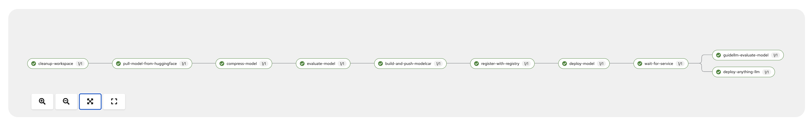

# ModelCar Pipeline

A Tekton pipeline for downloading models from Hugging Face, optionally compressing them, and building them into OCI images.



When the pipeline is triggered, it follows a sequential workflow: First, it cleans up any existing files in the workspace. Then, it downloads the specified model from Hugging Face, including only the files matching the allowed patterns. If compression is enabled, the model is processed using the LLM Compressor from Red Hat AI Inference Server, which quantizes the model to reduce its size while maintaining performance. The model files are then packaged into an OCI image using the OLOT tool, and the image is pushed to the specified Quay.io repository. Finally, the model is registered in the OpenShift model registry, where it can be discovered and used by other applications in the cluster.

## Features

- Downloads models from Hugging Face
- Optional model compression using the LLM Compressor from Red Hat AI Inference Server
- Builds models into OCI images
- Pushes images to Quay.io
- Registers models in the OpenShift model registry

## Prerequisites

- OpenShift cluster with Tekton installed
- GPU-enabled nodes (for model compression)
- Quay.io account with push access
- Hugging Face account with access to the desired model
- OpenShift model registry access

## Pipeline Parameters

- `HUGGINGFACE_MODEL`: The Hugging Face model repository (e.g., "ibm-granite/granite-3.2-2b-instruct")
- `OCI_IMAGE`: The OCI image destination (e.g., "quay.io/my-user/my-modelcar")
- `HUGGINGFACE_ALLOW_PATTERNS`: Optional array of file patterns to allow (default: "*.safetensors", "*.json", "*.txt")
- `COMPRESS_MODEL`: Whether to compress the model using the LLM Compressor
- `MODEL_NAME`: Name of the model to register in the model registry
- `MODEL_VERSION`: Version of the model to register (default: "1.0.0")
- `MODEL_REGISTRY_URL`: URL of the model registry service
- `SKIP_TASKS`: Comma-separated list of tasks to skip

## Model Compression

The pipeline can optionally compress models using the LLM Compressor. This process:
- Reduces model size while maintaining performance
- Requires GPU-enabled nodes
- Uses the `compress-model` task

### Compression Parameters

- `COMPRESS_MODEL`: Set to "true" to enable compression
- `BITS`: Number of bits for quantization (default: 4)
- `GROUP_SIZE`: Group size for quantization (default: 128)
- `DATASET`: Dataset to use for calibration (default: "c4")
- `SEQUENCE_LENGTH`: Maximum sequence length (default: 2048)

### Resource Requirements

- GPU with at least 16GB VRAM
- 32GB RAM
- 100GB storage

## Model Registry Integration

The pipeline can register models in the OpenShift model registry. This process:
- Creates a model entry in the registry
- Associates the model with its OCI image
- Stores metadata about the model

### Registry Parameters

- `MODEL_NAME`: Name of the model in the registry
- `MODEL_VERSION`: Version of the model
- `MODEL_REGISTRY_URL`: URL of the model registry service

### Model Metadata

The following metadata is stored with the model:
- Source: "huggingface"
- Framework: "pytorch"
- Compression status
- Model URI

## Usage

1. Create the required secrets:
   ```bash
   # Create Quay.io authentication secret
   oc create secret docker-registry quay-auth \
     --docker-server=quay.io \
     --docker-username=<your-username> \
     --docker-password=<your-password>

   # Create Hugging Face token secret (optional)
   oc create secret generic huggingface-secret \
     --from-literal=HUGGINGFACE_TOKEN=<your-token>
   ```

2. Create a persistent volume claim for model storage:
   ```bash
   oc apply -f modelcar-storage.yaml
   ```

3. Create the pipeline:
   ```bash
   oc apply -f modelcar-pipeline.yaml
   ```

4. Run the pipeline:
   ```bash
   oc apply -f modelcar-pipelinerun.yaml
   ```

### Example Configuration

```yaml
params:
  - name: HUGGINGFACE_MODEL
    value: "ibm-granite/granite-3.2-2b-instruct"
  - name: OCI_IMAGE
    value: "quay.io/my-user/modelcar-granite-3.2-2b-instruct"
  - name: HUGGINGFACE_ALLOW_PATTERNS
    value: "*.safetensors,*.json,*.txt"
  - name: COMPRESS_MODEL
    value: "true"
  - name: MODEL_NAME
    value: "granite-3.2-2b-instruct"
  - name: MODEL_VERSION
    value: "1.0.0"
  - name: MODEL_REGISTRY_URL
    value: "https://registry-rest.apps.dev.xxx.com"
  - name: SKIP_TASKS
    value: ""  # Run all tasks
```

## Monitoring

- Check pipeline status:
  ```bash
  oc get pipelinerun modelcar-pipelinerun
  ```

- View pipeline logs:
  ```bash
  oc logs -f $(oc get pods -l tekton.dev/pipelineRun=modelcar-pipelinerun -o name)
  ```

- View model in registry:
  ```bash
  oc get model granite-3.2-2b-instruct
  ```